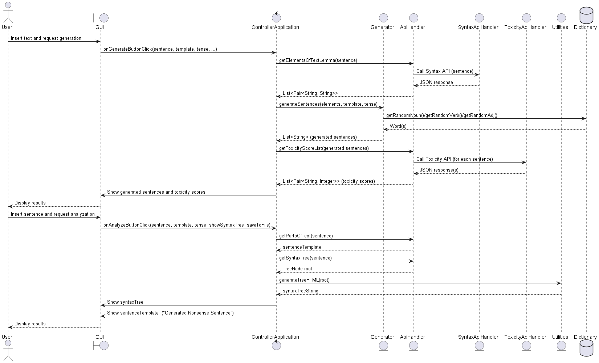
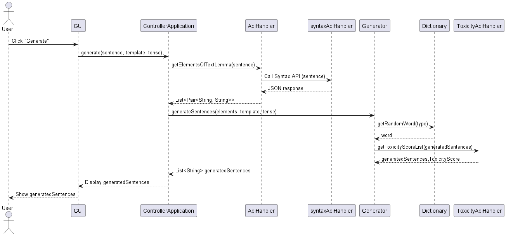
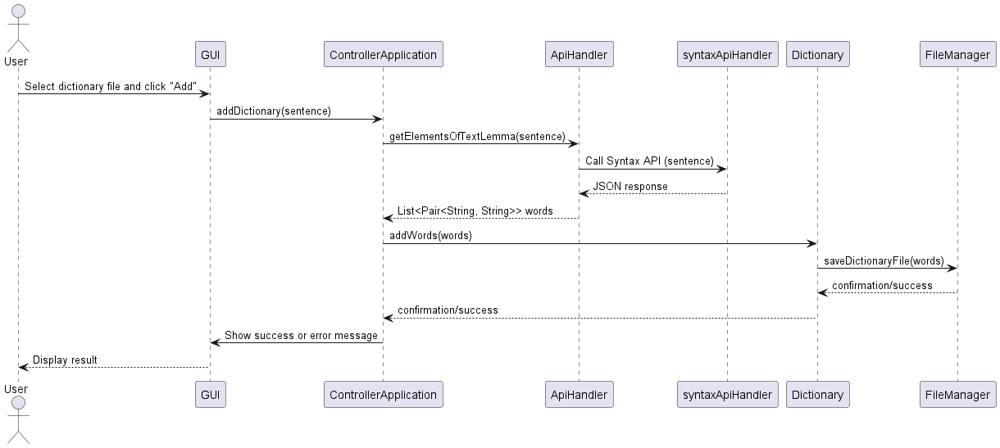
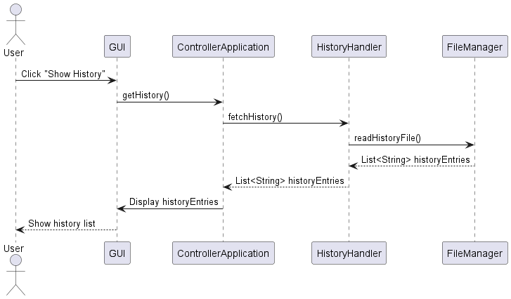
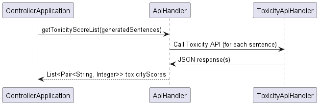
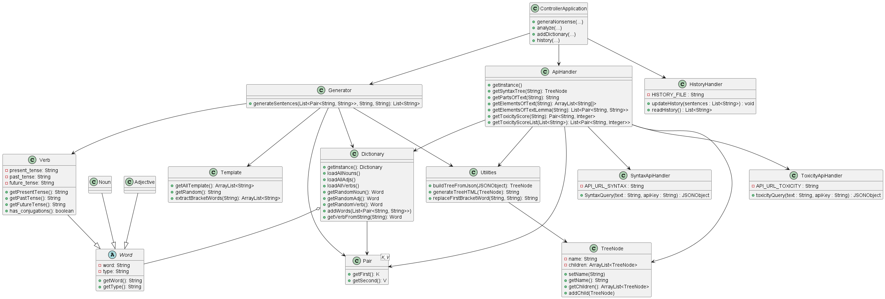

# **Design Document: Nonsense Generator**

## **Domain Model**

## **System Sequence Diagram**

## **Internal Sequence Diagram**

### GENERATE SENTENCE

### ANALYZE SENTENCE

### ADD TO DICTIONARY

### SHOW HISTORY

### TOXICITY CONTROLLER

## **Design Class Model Diagram**

### Component Descriptions

* **ControllerApplication**: Manages the main application flow, receiving user requests and coordinating operations among various handlers and the model. It routes requests to appropriate components and returns responses.

* **Generator**: Responsible for generating nonsense sentences. It uses data from the dictionary and templates to create new sentences, applying composition rules defined in the model.

* **ApiHandler**: Handles communication with external APIs (e.g., Google Syntax API and Toxicity API). Implements the Singleton and Facade patterns to centralize and simplify API access, managing request construction, sending, and response parsing.

* **HistoryHandler**: Manages the history of generated sentences and performed analyses. It allows saving, retrieving, and displaying the user's operation history.

* **Dictionary**: Represents the internal dictionary of the application, containing words, verbs, templates, and other linguistic structures. Provides methods to add, modify, and retrieve elements, supporting sentence generation and analysis.

## **Architectural Pattern**

The **NONSENSE-GENERATOR** project follows the **MVC (Model-View-Controller)** architectural pattern, applied as follows:

**Model**: Includes classes that represent domain logic and data, such as `Dictionary`, `Word`, `Verb`, `Template`, etc. These classes manage word structures, templates, and data operations.

**View**: Consists of HTML files (e.g., `index.html`, `error.html`) and static resources located in the `resources/static/` folder. These files define the user interface and display results.

**Controller**: Classes in the `controller` folder (such as `ControllerApplication`, `ApiHandler`, `HistoryHandler`) handle user requests, coordinate interaction between the Model and the View, and return appropriate responses.
In summary, the Controller receives requests from the View, uses the Model to process data, and updates the View with results, clearly separating presentation logic from business logic.

## **Design Patterns**

1. **Singleton**:
   The `ApiHandler` class implements the Singleton pattern. It has a private static field:
   `private static ApiHandler INSTANCE` which holds the single instance of the class.
   The constructor is private, so it cannot be called from outside.
   The public static method `getInstance()` checks whether the instance already exists; if not, it creates and returns it. This ensures only one `ApiHandler` instance exists in the application.
   This pattern is used to centralize API call management and API key access, avoiding duplication and ensuring consistency.

2. **Facade**:
   The entire `ApiHandler` class functions as a Facade. It exposes simple methods such as `getSyntaxTree`, `getPartsOfText`, `getToxicityScore`, etc.
   It hides the complexity of external API calls (Google Syntax API, Toxicity API), key management, request construction, and JSON response parsing.
   Other components can interact with APIs through a simple and consistent interface, without worrying about implementation details.
   The Facade pattern simplifies the use of complex systems by providing a single point of access and hiding internal logic.

3. **Adapter**:
   Present in methods that convert API responses into Java data structures, such as `getElementsOfText`, `getElementsOfTextLemma`, `getToxicityScore`, and `getToxicityScoreList`, which receive JSON responses from external APIs.
   These methods transform (adapt) the JSON data into Java objects and data structures (`ArrayList<String[]>`, `List<Pair<String, String>>`, `Pair<String, Integer>`, etc.) that are easier to use throughout the application.
   The Adapter pattern is used to make different data formats compatible, allowing the application to work with data from external sources without handling the original format directly.
